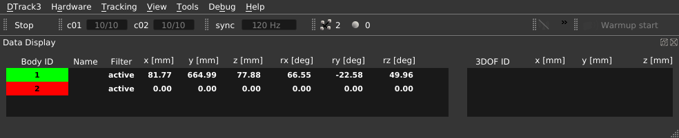
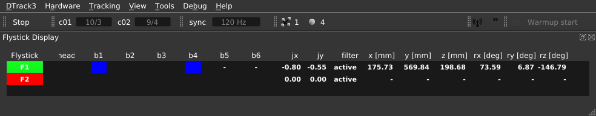

# DTrack Plugin for the Unity Game Engine 2019.x

This is a component for Unity 2019.1 or later with the purpose of
native integration of the Advanded Realtime Tracking (ART) DTrack
(versions 2 and 3) tracking solutions. This Unity Asset provides
access to DTrack tracking data, that is send over network using
UDP/IP datagrams. Each UDP packet contains one frame of tracking
data including all outputs activated via the DTrack software (see
Section [**DTrack**](#DTrackShortGuide)). This package currently
supports the DTrack body `6d` and flystick `6df2` data formats.

## Download 

You can download or clone sources for this Asset package at
[GitHub](http://github.com/ar-tracking/UnityDTrackPlugin)

## Prerequisites

To use this Asset the following components are required.

- Unity Editor 2019.1 or later
- Windows 64 bit, Linux 64 bit
- ART Tracking system and DTrack2/DTrack3
- UnityDTrackPlugin package (Asset)
- DTrack User's Guide (_optional_)
- DTrack Programmer's Guide (_optional_)

### Creating the Unity DTrack Plugin package from sources

In order to create a Unity package from the provided sources, follow
the steps below.

1. Download or clone sources for this Asset package ( see [**Download**](#download) )
- Launch Unity
- Create new Unity project ( e.g., "MyUnityProject" )
- Extract the asset package, if applicable
- Copy the directory *UnityDTrackPlugin* to your projects asset directory ( /path/to/unity/projects/*MyUnityProject*/Assets/**DTrack** )
- Export package ( right-click on DTrack in the **Project** window and
  select **Export Package...** )

### Importing Unity package

1. Launch Unity
- Create/Open Unity project
- Import package ( *Assets* &rarr; *Import Package...* &rarr; *Custom Package...* )

## DTrack Configuration

Find here a quick-start guide to DTrack. For details, please, refer
to your DTrack User's Guide and DTrack Programmer's Guide, that is
shipped with the DTrack distribution. In this section we assume that
the ART tracking system is properly set up and a room calibration
was done. Further, a set of 6DOF targets and flysticks are
calibrated.

### Room Calibration

For general information about the DTrack room calibration and room
adjustment see the DTrack User's Guide. Here we discuss details
relevant for use with the Unity Engine.

The calibration angle which comes with your ART tracking system
defines the coordinate system layout in your tracking area. It
consists of four retroreflective or active markers mounted onto an
L-shaped frame.

The marker on top of the edge of this L-shape by default designates
the origin of the DTrack coordinate system. When using the _Normal_
calibration mode (see Figure below), the long arm of this L-shape
corresponds to the X axis and the short arm to the Y axis. DTrack
coordinates refer to a right-handed coordinate system, so when the
angle is placed flat on the ground with the markers pointing up the
Z axis points upwards.

  

The plugin transforms a right-handed position of a DTrack 6DOF
measurement to a left-handed Unity position by switching the Y
and Z axes, i.e., 

**(** ***X***Unity , ***Y***Unity ,
***Z***Unity ) = ( ***X***DTrack ,
***Z***DTrack, ***Y***DTrack **)**.

  

DTrack offers a multitude of ways to adjust coordinate systems for
room and bodies, e.g., offsets, scaling, additional rotations, or
shifting the origin of bodies. Consult your manual for details on
*Room adjustment* and *Body adjustment*.

### Setting outputs 

To configure the tracking data stream generated by DTrack, execute
these steps:

1. Activate a channel if needed
- Fill in the IP/Port of the device receiving tracking data
- Select outputs you are interested in (i.e., currently frame counter `fr`,
time stamp `ts`, 6DOF standard body `6d` and flystick `6df2` are
supported) via the menu *Tracking* &rarr; *Output* (DTrack3) or *Settings*
&rarr; *Output* (DTrack2), respectively.

  

### Data display ( 6DOF ) 

Enable the *data display* view ( *View* &rarr; *Data* ) to find
assigned body IDs. In this table, both position and rotation for
standard bodies can be observed while moving the target inside the
tracking volume.

  

### Data display ( Flystick ) 

Enable the *flystick* view ( *View* &rarr; *Flystick* ) to find
assigned flystick IDs. Listed flystick IDs are prefixed with a
capital **`F`**. When referencing flysticks from within Unity in the
`DTrackReceiverFlystick` mask, this prefix must be removed. In addition to
position and rotation data, button presses (_b1_,...,_b6_), joystick movement
(_jx_,_jy_) are illustrated in the table.

  

## Plugin Configuration

Streaming position, rotation and button events data from DTrack
tracking systems to objects in your scene, requires appropriate
network settings. In your scene add an *Empty* game object and give
it a name, e.g., **DTrackSource**. To this object attach the
**DTrack** script via *Add Component* &rarr; *Scripts* &rarr;
*DTrack* &rarr; *DTrack*. Set *Listen Port* number matching the
setting for DTrack (see Section [**Setting outputs**](#DTrackSettingOutputs)
below). Note that 3D position data in the DTrack output stream have unit
millimeters. The DTrack Unity Plugin converts such values to unit meter.

  

### Applying 6DOF Body data

In your scene attach via *Add Component* the DTrack script
`DTrackReceiver6Dof` to an object you want to receive positional and
rotational data. In the `DTrackReceiver6Dof` mask type in the ID
that was assigned to the body by DTrack
(see Section [**Data display (6DOF)**](#DTrackDataDisplay6DOF)).

  

When the ART tracking system is running, you should now be able to
see *Position* and *Rotation* data in the **Transform** box, as soon
as you switch to *Play* mode.

### Applying Flystick data

In your scene attach via *Add Component* the DTrack script
`DTrackReceiverFlystick` to an object you want to receive positional
and rotational data as well as interactive button and joystick
events. In the `DTrackReceiverFlystick` mask type in the ID that was
assigned to the flystick by DTrack
(see Section [**Data display (Flysticks)**](#DTrackDataDisplayFlystick)).

  

### Attaching 6DOF Targets to Camera

For non-static, point-of-view cameras, you can attach a DTrack
Receiver with positional and rotational data, e.g., 6DOF body or
flystick.

  

