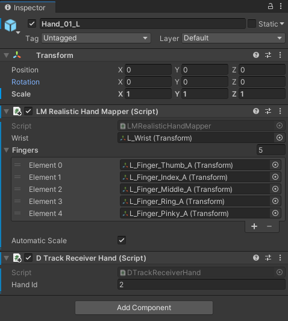

# DTRACK Plugin for Unity Game Engine 2019.x or later

This is a component for Unity 2019.1 or later with the purpose of
native integration of the Advanced Realtime Tracking (ART) DTRACK
(DTrack2 or DTRACK3) tracking solutions. This Unity Asset provides
access to DTRACK tracking data, that is sent over network using
UDP/IP datagrams. Each UDP packet contains one frame of tracking
data including all outputs activated via the DTRACK software (see
section [**DTRACK Configuration**](#dtrackconfiguration)). This package currently
supports the DTRACK Standard Body (`6d`), Flystick (`6df2`) and Fingertracking (`gl`) data formats.

## Download 

You can download a ready-to-use Unity package ( UnityDTrackPlugin-vX.X.X.unitypackage ) at
[GitHub releases](http://github.com/ar-tracking/UnityDTrackPlugin/releases).

You can download or clone sources for this Asset package at
[GitHub](http://github.com/ar-tracking/UnityDTrackPlugin).

## Prerequisites

To use this Asset the following components are required:

- Unity Editor 2019.1 or later
- Windows 64 bit, Linux 64 bit
- ART tracking system and DTrack2/DTRACK3
- UnityDTrackPlugin package (Asset)
- DTRACK3 User's Guide (_optional_)
- DTRACK3 Programmer's Guide (_optional_)

### Creating the Unity DTRACK Plugin Package from Sources

If you downloaded a ready-to-use Unity package ( UnityDTrackPlugin-vX.X.X.unitypackage ),
proceed with section [**Importing Unity Package**](#importing).

In order to create a Unity package from the provided sources, follow
the steps below.

1. Download or clone sources for this Asset package ( see section [**Download**](#download) )
- Launch Unity Hub
- Create new Unity project ( e.g., "MyUnityProject" )
- Extract the asset package, if applicable
- Copy the content of directory *UnityDTrackPlugin* to your projects asset directory ( /path/to/unity/projects/*MyUnityProject*/Assets/**DTrack** )
- Export package ( right-click on **DTrack** in the **Project** window and
  select *Export Package...* )

**Please note:** if you created the Unity package from sources and you want to try the available example scene,
you need to assign DTrack scripts and to configure the plugin manually ( see section
[**Plugin Configuration**](#pluginconfiguration) ).

### Importing Unity Package 

1. Launch Unity Hub
- Create/Open Unity project
- Import package ( *Assets* &rarr; *Import Package...* &rarr; *Custom Package...* )

### Updating from Unity DTRACK Plugin v1.0.3

To update the DTRACK Plugin within an existing Unity project it's necessary to replace the entire directory
/path/to/unity/projects/*MyUnityProject*/Assets/**DTrack**/ .

1. Launch Unity Hub
- Open Unity project
- Remove directory /path/to/unity/projects/*MyUnityProject*/Assets/**DTrack**/ , either manually or in Unity Editor ( *Project* &rarr; *Assets* &rarr; *DTrack* &rarr; *(right click) Delete* )
- Install the DTRACK Plugin from Unity package (see above)

There's no need to adjust settings in already attached scripts ( **DTrack**, **DTrackReceiver6Dof**, **DTrackReceiverFlystick** ).

**Please note:** the so far used 'Unity events' to notify pressed Flystick buttons were declared deprecated
and will be replaced in some future version of the plugin. Please don't use them in new projects
( see section [**Applying Flystick Data**](#pluginconfigurationflystick) ).

**Tip:** if after an update existing button event settings ( *Button Press Event X*, now denoted as
*Button X Pressed Event Depricated* ) are not shown in Unity Editor, exiting and re-starting of the Unity Editor might help.

## DTRACK Configuration 

Find here a quick-start guide to DTRACK. For details, please refer
to your DTRACK3 User's Guide and DTRACK3 Programmer's Guide, that is
shipped with the DTRACK distribution. In this section we assume that
the ART tracking system is properly set up and a room calibration
was done. Further, a set of Standard Bodies and/or Flysticks and/or Fingertracking hands is
calibrated.

### Room Calibration

For general information about the DTRACK room calibration and room
adjustment see the DTRACK User's Guide. Here we discuss details
relevant for use with the Unity Engine.

The calibration angle tool which comes with your ART tracking system
defines the coordinate system layout in your tracking area. It
consists of four retroreflective or active markers mounted onto an
L-shaped frame.

 

The marker on top of the edge of this L-shape by default designates
the origin of the DTRACK coordinate system. When using the _Normal_
calibration mode (see figure below), the long arm of this L-shape
corresponds to the X axis and the short arm to the Y axis. DTRACK
coordinates refer to a right-handed coordinate system, so when the
tool is placed flat on the ground with the markers pointing up the
Z axis points upwards.

 

The plugin transforms a right-handed position of a DTRACK 6DOF
measurement to a left-handed Unity position by switching the Y
and Z axes, i.e., 

**(** ***X***Unity , ***Y***Unity ,
***Z***Unity ) = ( ***X***DTRACK ,
***Z***DTRACK, ***Y***DTRACK **)**.

 

DTRACK offers a multitude of ways to adjust coordinate systems for
room and bodies, e.g., offsets, scaling, additional rotations, or
shifting the origin of bodies. Consult your manual for details on
*Room adjustment* and *Body adjustment*.

### Setting Outputs 

To configure the tracking data stream generated by DTRACK, execute
these steps:

1. Open dialog *Output Settings* via menu *Tracking* &rarr; *Output* (DTRACK3) or *Settings*
&rarr; *Output* (DTrack2), respectively
- Activate a channel if needed
- Fill in hostname or IP address, and UDP port number of the device receiving tracking data
- Select outputs you are interested in (i.e., currently frame counter `fr`,
6DOF Standard Body `6d`, Flystick `6df2` and Fingertracking `gl` are
supported)

 

### Identifying Body IDs 

There are several ways to identify the ID numbers of DTRACK Standard Bodies, Flysticks and Fingertracking hands,
as needed later to configure the Unity plugin. E.g. refer to column *ID* in dialog *Body Administration*
via menu *Tracking* &rarr; *Body Administration* (DTRACK3) or *Settings* &rarr; *Body Administration* (DTrack2).

 

Note that listed Flystick IDs are prefixed with a capital **`F`**, as well as listed Fingertracking hand IDs
are prefixed with a capital **`H`**. When referencing Flysticks or Fingertracking hands from within Unity,
this prefix must be removed.

 

## Plugin Configuration 

Streaming position, rotation and button events data from DTRACK
tracking systems to objects in your scene, requires appropriate
network settings. In your scene add an *Empty* game object and give
it a name, e.g., **DTrackSource**. To this object attach the
**DTrack** script via *Add Component* &rarr; *Scripts* &rarr;
*DTrack* &rarr; *DTrack*. Set *Listen Port* number matching the
setting for DTRACK (see section [**Setting Outputs**](#dtracksettingoutputs)).
Note that position data in the DTRACK output stream have unit
millimeters. The DTRACK Unity Plugin converts such values to unit meter.

 

### Applying 6DOF Standard Body Data

In your scene attach via *Add Component* the DTrack script
**DTrackReceiver6Dof** to an object you want to receive positional and
rotational data. In the `DTrackReceiver6Dof` mask type in the ID
that was assigned to the Standard Body by DTRACK
(see section [**Identifying Body IDs**](#dtrackidentifyingbodyids)).

 

When the ART tracking system is running, you should now be able to
see *Position* and *Rotation* data in the **Transform** box, as soon
as you switch to *Play* mode.

### Applying 6DOF Standard Body Data to the Camera

For non-static, point-of-view cameras, you can attach a DTRACK
Receiver with positional and rotational data, e.g. of a 6DOF Standard Body.

 

### Applying Flystick Data 

In your scene attach via *Add Component* the DTrack script
**DTrackReceiverFlystick** to an object you want to receive positional
and rotational data. In the `DTrackReceiverFlystick` mask type in the ID that was
assigned to the Flystick by DTRACK
(see section [**Identifying Body IDs**](#dtrackidentifyingbodyids), without prefixed capital **`F`**).

 

DTrack script **DTrackReceiverFlystick** can send 'Unity events' to announce changed Flystick buttons
or joystick values to scripts attached to arbitrary game objects. It provides:

- 8 events on changed Flystick buttons corresponding to the (maximum) number of 8 buttons of Flystick2+
  ( *Button X Changed Event* ); an event is invoked once every time a button is pressed or released
- One event on changed Flystick joystick values (horizontal and vertical) ( *Joystick Changed Event* );
  the event is invoked every time one of the values has changed
- One event on changed trigger value (just available at Flystick2+) ( *Analog 3 Changed Event* ); the event
  is invoked every time the value has changed

**Please note:** the so far (Unity DTRACK plugins v1.0.X) used 'Unity events' to notify pressed Flystick
buttons ( *Button Press Event X* ) were declared deprecated and will be replaced in some future version of the plugin.
Please don't use them in new projects.

 

See script **ExampleFlystickListener** on how to receive these 'Unity events' in your scripts. To register an own
listener routine first create an additional entry in the wanted *Event* element by pressing *+*. Then drag
and drop the game object, that should receive the event, from the *Hierarchy* tree into the *Event* element.
Finally choose the listener routine's name.

### Applying Fingertracking Data

The DTRACK Plugin provides support of ART Fingertracking, so far adjusted
for usage with 'Leap Motion Realistic Male Hands' (by Storkplay, available at
the Unity Asset Store), or hand models with equivalent rig and coordinate systems:

- https://assetstore.unity.com/packages/3d/characters/humanoids/leap-motion-realistic-male-hands-109961

 

Add one of the *Prefabs* of your **LMRealisticMaleHands** asset to your scene.

Within the root object of the created left or right hand (`Hand_0X_L` or `Hand_0X_R`)
now two components with missing scripts appear. Remove these components via
*Remove Component*, attach instead via *Add Component* the DTrack script
**LMRealisticHandMapper**. It automatically will attach also a DTrack script
**DTrackReceiverHand**.

In `DTrackReceiverHand` mask enter the *Hand Id* that was assigned to the Fingertracking device by DTRACK
(see section [**Identifying Body IDs**](#dtrackidentifyingbodyids), without prefixed capital **`H`**).

In `LMRealisticHandMapper` mask first ensure that the number of elements in list *Fingers* is *5*.
Now enter links to the corresponding game objects of the hand,
for *Wrist* (`L_Wrist` or `R_Wrist`) and the fingers' root joints (`L_Finger_Index_A`, ... or
`R_Finger_Index_A`, ...). This can be done e.g. by dragging and dropping the objects from the *Hierarchy*
tree into the `LMRealisticHandMapper` mask.
The elements of *Fingers* have to be ordered as: thumb, index, middle, ring, pinky.

 

If the real size of the person's hand is differing too much from the hand model's size, it might be useful
to modify the *Scale* factor in the **Transform** box of the hand's root object (`Hand_0X_L` or `Hand_0X_R`).
If setting *Automatic Scale* is enabled, the hand mapper script tries to find a suitable value automatically.

  

Advanced Realtime Tracking GmbH & Co. KG 
Am Oeferl 6 
82362 Weilheim i. OB 
Germany 

http://ar-tracking.com

